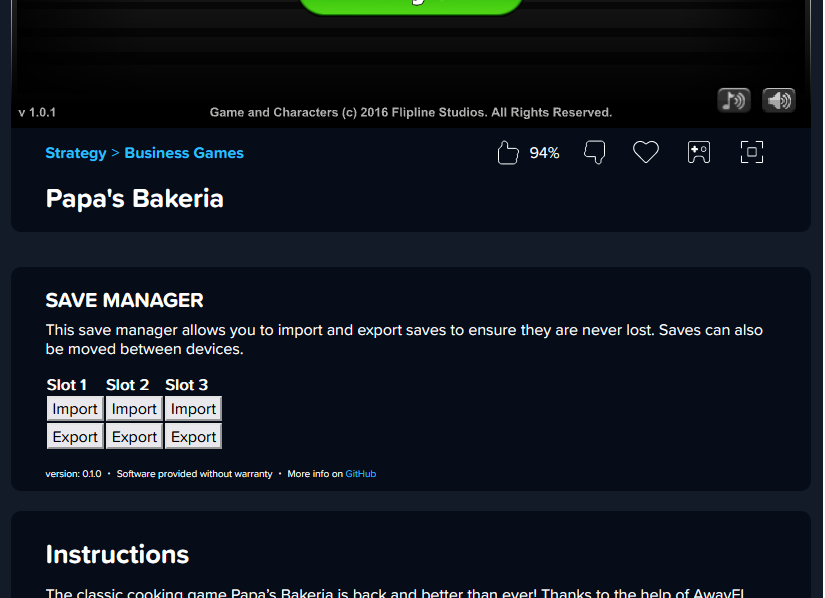

# Papa's Save Manager
Papa's Save Manager (PSM), formerly known as PBSM is a userscript which allows you to backup save data for the Papa's series of flash games hosted on [coolmathgames.com](https://www.coolmathgames.com/papas-games). Backing up saves allows them to be restored in the event that browser data is accidentally/ unintentionally cleared, or if you wish to play the game on another browser or device.

The number of supported games is expected to increase with each new version.

## Supported Games
- [Papa's Bakeria](https://www.coolmathgames.com/0-papas-bakeria)
- [Papa's Freezeria](https://www.coolmathgames.com/0-papas-freezeria)

## Features
- Export save data to file
- Import save data from file

## How to Install
The script must be installed into a userscript manager such as Violentmonkey or Tampermonkey.
1. Ensure the userscript manager is installed onto you browser of choice. A comprehensive list of userscript managers can be found on [greasyfork.org](https://greasyfork.org/en/help/installing-user-scripts)
2. Click [here](https://greasyfork.org/en/scripts/474235-papa-s-save-manager) to install the lastest release from greasyfork. Alternatively, you can install the latest pre-release by creating a new script, and pasting in the contents of src/papas-save-manager.js
3. Navigate to the game (see links above) and you should see the save manager below the game's canvas, as illustrated in the above preview.
